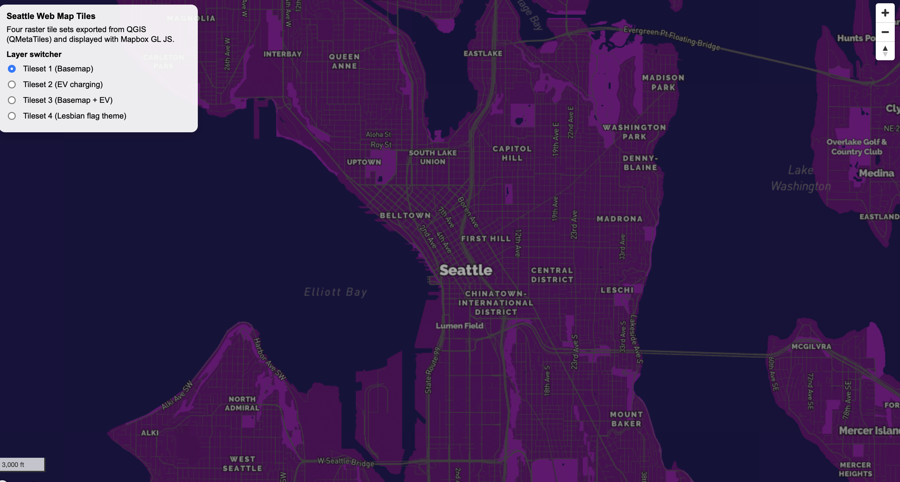
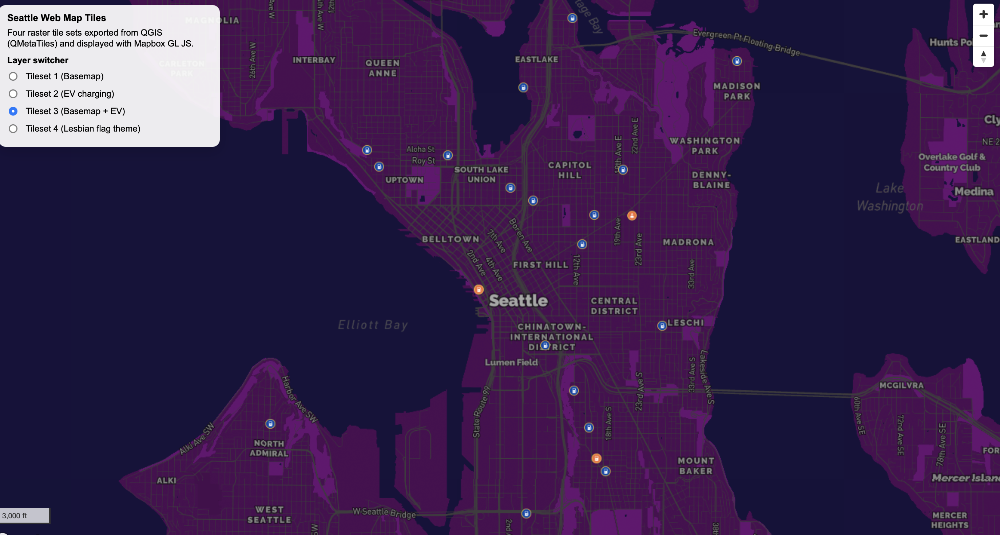
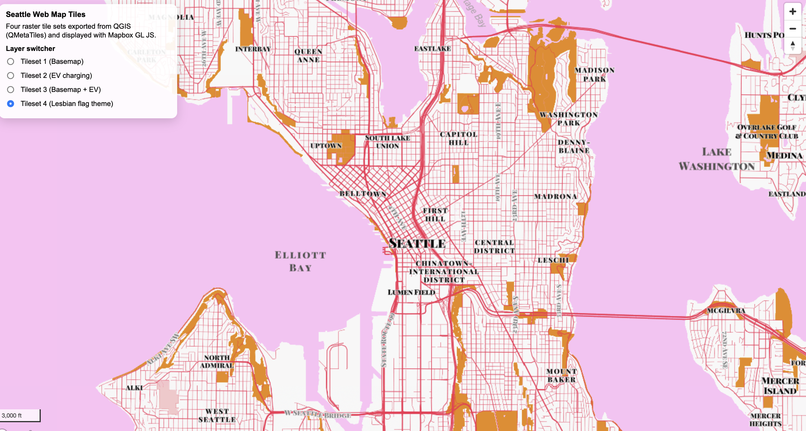

# GEOG 458 – Lab 4: Map Design and Tile Generation

## Live Web Map

---

## Study Area
The map focuses on Seattle, Washington. The extent covers the central city and surrounding neighborhoods where EV charging stations are located.

---

## Zoom Levels
All tile sets were exported in QGIS using the same zoom range to maintain consistency and manage file size.

- Tileset 1: 12–14  
- Tileset 2: 12–14  
- Tileset 3: 12–14  
- Tileset 4: 12–14  

---

## Tileset Descriptions

### Tileset 1 – Basemap
This is the general basemap, set to show contrast and monochromatic purple colors. It's a variation of the Dark basemap.

---

### Tileset 2 – EV Charging Stations
This layer displays public EV fast charging station locations in Seattle. This data was linked to QGIS layer through the API the city of Seattle provided.

---

### Tileset 3 – Basemap + EV Charging Stations
This map combines the basemap with the EV charging station dataset. It creates context for the EV charging stations so people are able to visualize where they are located.

---

### Tileset 4 – Lesbian Pride Themed Basemap
This layer applies a lesbian pride flag color palette. The goal is to highlight lesbian pride and illustrate Seattle as an openly queer and queer accepting space. Map was symbolized to make sure everything was still clear and legible while maintaining thematic concept. 

